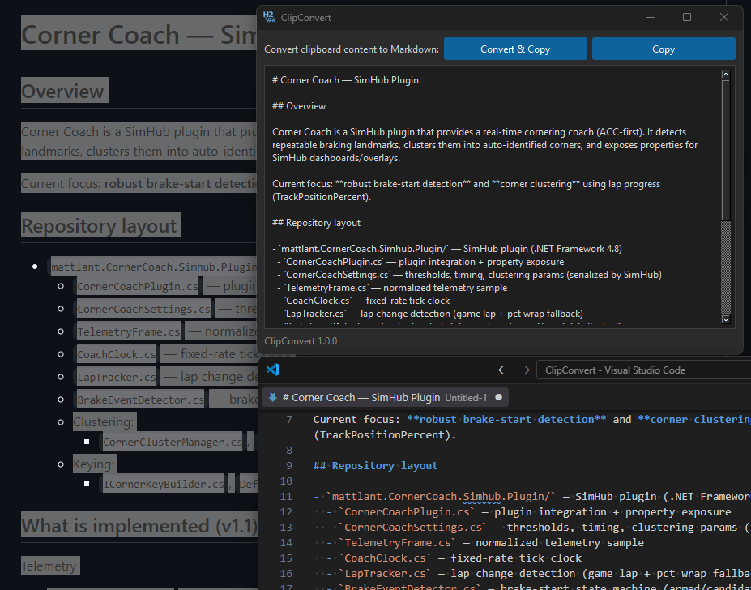

# ClipConvert

Turn rich clipboard content into clean Markdown, then put it straight back on the clipboard.

ClipConvert is a small Windows and Linux desktop utility for those moments when you want to copy formatted content from somewhere else and use it as predictable Markdown.

I built it mainly because this comes up constantly in AI workflows. Copying documentation, web content, issue details, formatted notes, or other structured text into a prompt or context window often means relying on the destination application to interpret rich clipboard content the way you hope it will.

ClipConvert removes that variable. Copy the content, convert it, and the clipboard now contains Markdown you can paste wherever you need it.

That makes it useful well beyond AI too. Any time the destination expects plain text or Markdown, ClipConvert gives you a quick way to normalize what you copied before it gets there.



## Why HTML?

One thing that makes ClipConvert surprisingly useful is that many applications place more than one representation on the clipboard when you copy formatted content. Alongside their native format, they often include an HTML representation.

That means ClipConvert can work with much more than web pages. Content copied from applications such as Word, Excel, browsers, and other rich editors can often be converted directly to Markdown without exporting or saving anything first.

For me, Excel is a great example: copy a table, run it through ClipConvert, modify conversion if needed and you have a Markdown table ready to paste into an AI conversation, prompt, document, or issue.

## What gets converted

ClipConvert converts HTML clipboard content to Markdown, including common structure such as:

- headings and paragraphs;
- bold and italic text;
- links and images;
- ordered and unordered lists;
- tables;
- code and blockquotes;
- horizontal rules and line breaks.

Because many desktop applications place an HTML representation on the clipboard when copying formatted content, this covers a lot of everyday content from browsers, Word, Excel, and similar applications.

## Installation

ClipConvert requires Python 3.12 or later.

Clone the repository, create and activate a virtual environment, then install:

```bash
git clone https://github.com/mattlant/clipconvert.git
cd clipconvert

python -m venv .venv
```

Activate the environment:

```bash
# Windows
.venv\Scripts\activate

# Linux
source .venv/bin/activate
```

Install ClipConvert:

```bash
pip install .
```

### Optional standalone Windows build

For a more native Windows experience, including the correct ClipConvert icon in Explorer and on the taskbar, you can build a standalone executable with PyInstaller:

```bash
pip install pyinstaller

python -m PyInstaller \
  --name ClipConvert \
  --windowed \
  --onedir \
  --icon src/clipconvert/assets/clip-convert-light.ico \
  --collect-data clipconvert \
  src/clipconvert/main.py
```

The resulting application will be created under:

```text
dist/ClipConvert/
```

Run:

```bash
dist/ClipConvert/ClipConvert.exe
```

Optionally, create a shortcut to `ClipConvert.exe` and place it in:

```text
%APPDATA%\Microsoft\Windows\Start Menu\Programs
```

ClipConvert will then appear in the Windows Start menu and search.

*This standalone build path is intended for Windows and has not been validated yet for Linux.*

## Usage

Launch ClipConvert:

```bash
clipconvert
```

if using optional install, launch in the manner outlined above.

Then:

1. Copy rich or HTML content from another application.
2. Click **Convert & Copy**.
3. Paste the resulting Markdown wherever you need it.

You can also edit the converted Markdown directly in ClipConvert and click **Copy** again.

## Development

Install the project in editable mode:

```bash
pip install -e .
```

Run the test suite:

```bash
PYTHONPATH=src python -m unittest discover -s tests -p "test_*.py" -v
```

## Requirements

- Windows or Linux
- Python 3.12 or later
- PySide6
- markdownify
- setuptools

## Configuration

ClipConvert uses a dark theme by default. To use the light theme instead, change `THEME` in `src/clipconvert/config.py`.

## License

ClipConvert is licensed under the MIT License. See `LICENSE` for details.
